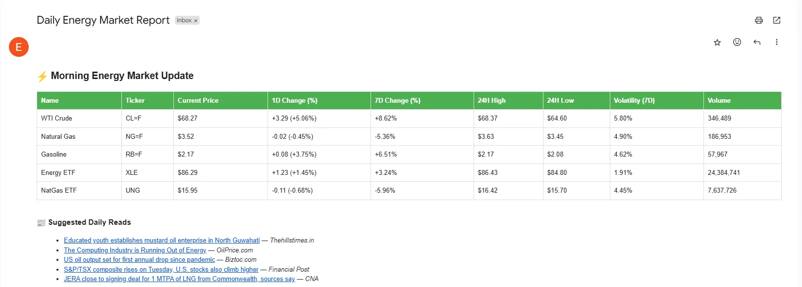

# Energy Market Email Project

## **Setup & Version Control**

This project is built using **VSCode** and hosted on **GitHub** for version control and backup .

- **GitHub:** My online repository serves as a place to track code history and to save on the cloud.
- **Commits:** As I work in VScode, I will commit changes to capture milestones.
- **Pushes:** After committing, I push updates to GitHub, ensuring tha changes are backed up and viewable online.

**Main reasons for GitHub use:**

- **Version control -** Track every change and revert easily if needed.
- **Cloud Backup -**  Avoid losing work due to local corruption or erros.
- **Famililiarity -** Familiarise myself with how to use Git.

## Step 1 - Market indicators to Track

To provide vlaue in a daily market email, I’ve selected five key energy-related tickers on relevance, volatility, and sector representation. 

**CL1! (WTI Crude Oil Futures)**

**Why:** A major U.S. benchmark for global crude prices. 

**Key Drivers:** 

- Geopolitcal events
- OPEC production levels
- U.S. inventory reports
- USD strength and inflation

**WTI prices influence oil company margins, energy trader sentiment, and macroeconomic outlooks.** 

**NG1! (Natural Gas Futures)**

**Why:** Critical for heating, electricity, and industrial use

**Key Drivers:**

- seasonal demand (cold winters, hto summers)
- Storage level updates
- LNG export trends
- Weather-related supply shocks

**Natural gas volatility directly impacts utility providers and hedge planning.** 

**RB1! (RBOB Gasoline futures)**

**Why:** Represent U.S. gasoline prices, a key consumer- facing fuel. 

**Key Drivers:**

- Crude oil price movements
- Refinery disruptions
- Seasonal demand spikes

**Gasoline pricing affects retail fuel prices and refining profitability.** 

**XLE (Energy Sector SPDR ETF)**

**Why:** Tracks large-cap U.S. energy companies (e.g., ExxonMobil, Chevron).

**Key Drivers:**

- Commodity price fluctuations
- Earnings announcements
- Investor sentiment
- ESG/regulatory changes

**XLE provides a financial overview of the energy sector.** 

**UNG (United States Natural Gas Fund ETF)**

**Why:** Mirrors natural gas futures movements, popular with retail traders.

**Key Drivers:**

- Same as NG1!
- ETF inflows/outflows
- Fund rebalancing

**UNG adds an equity-based blend to gas market movements.** 

## Step 2 -Market_data_fetcher.py

This scirpt fetches data from Yahoo Finance using yfinance, then formats it into a structured table using tabulate. 

**Code break down:**

```python
import yfinance as yf
from tabulate import tabulate

def fetch_market_data():
    tickers = {
        "CL=F": "WTI Crude",
        "NG=F": "Natural Gas",
        "RB=F": "Gasoline",
        "XLE": "Energy ETF",
        "UNG": "NatGas ETF"
    }
```

- We start by defining a dictionary of tickers and labels for reference.
- Data is fetched using `yf.Ticker(symbol).history(period="7d")`.

**Looping through the tickers:**

```python
rows = []

    for symbol, name in tickers.items():
        ticker = yf.Ticker(symbol)
        data = ticker.history(period="7d")

        if data.empty or len(data) < 2:
            continue
```

- This loop pulls historical data for each ticker.
- Skips any that return empty (e.g. weekends or holidays).

**Calculating key metrics:**

```python
latest = data.iloc[-1]
        previous = data.iloc[-2]

        current_price = latest['Close']
        prev_price = previous['Close']
        abs_change = current_price - prev_price
        pct_change = (abs_change / prev_price) * 100

        week_ago = data.iloc[0]['Close']
        weekly_change = ((current_price - week_ago) / week_ago) * 100

        high_24h = latest['High']
        low_24h = latest['Low']
        volume = latest['Volume']
        volatility = ((high_24h - low_24h) / prev_price) * 100
```

- Calculates 1D and 7D price changes, volatility, volume, and daily range.

**Storing results in a table:**

```python
rows.append([
            f"{name}",
            symbol,
            f"${current_price:.2f}",
            f"{abs_change:+.2f} ({pct_change:+.2f}%)",
            f"{weekly_change:+.2f}%",
            f"${high_24h:.2f}",
            f"${low_24h:.2f}",
            f"{volatility:.2f}%",
            f"{volume:,.0f}"
        ])
```

## Step 3 - email_sender_script.py

Now that data is collected and formatted, i sent it via email using smtplib

**Import packages and environment variables:**

```python
from tabulate import tabulate
import smtplib
from email.mime.multipart import MIMEMultipart
from email.mime.text import MIMEText
import os
from dotenv import load_dotenv

load_dotenv()

```

- **`load_dotenv()`** loads my email credentials securely from `.env`.

**Format HTML email body:**

```python
def send_email(rows, headers, news_articles):
    
    
    html_table = tabulate(rows, headers=headers, tablefmt="html")

    
    news_html = "<h3>📰 Suggested Daily Reads</h3><ul>"
    for article in news_articles:
        news_html += f'<li><a href="{article["url"]}" target="_blank">{article["title"]}</a> — <em>{article["source"]}</em></li>'
    news_html += "</ul>"

```

- Combines table with a daily curated list of news articles.

**Compose and send the email:**

```python
 html_content = f"""
    <html>
      <head>
        <style>
          body {{
            font-family: Arial, sans-serif;
            line-height: 1.6;
          }}
          table {{
            border-collapse: collapse;
            width: 100%;
          }}
          th, td {{
            border: 1px solid #dddddd;
            text-align: left;
            padding: 8px;
          }}
          tr:nth-child(even) {{
            background-color: #f9f9f9;
          }}
          th {{
            background-color: #4CAF50;
            color: white;
          }}
        </style>
      </head>
      <body>
        <h2>⚡ Morning Energy Market Update</h2>
        {html_table}
        <br>
        {news_html}
        <p>Have a great trading day! 🚀</p>
      </body>
    </html>
    """

    
    sender_email = os.getenv("EMAIL_ADDRESS")
    receiver_email = os.getenv("EMAIL_ADDRESS")  
    password = os.getenv("EMAIL_PASSWORD")

    if not sender_email or not password:
        print("❌ Missing email credentials in environment variables.")
        return

    # Compose and send the email
    msg = MIMEMultipart("alternative")
    msg["Subject"] = "Daily Energy Market Report"
    msg["From"] = sender_email
    msg["To"] = receiver_email
    msg.attach(MIMEText(html_content, "html"))

    try:
        with smtplib.SMTP_SSL("smtp.gmail.com", 465) as server:
            server.login(sender_email, password)
            server.sendmail(sender_email, receiver_email, msg.as_string())
        print("✅ Email sent successfully!")
    except Exception as e:
        print(f"❌ Failed to send email: {e}")
```

## Step 4 - fetch_relevant_news.py

this script fetches recent mews articles related to energy form NewsAPI, filters them by relevance and uniqueness, and retursn 5 new articles

**Code breakdown:**

```python
import requests
from datetime import datetime, timedelta
import os
import json
from dotenv import load_dotenv

load_dotenv()  

NEWS_API_KEY = os.getenv("NEWS_API_KEY")
HISTORY_FILE = "sent_articles.json"

ENERGY_KEYWORDS = [
    "energy", "oil", "gas", "electricity", "renewable", "power", 
    "natural gas", "fossil", "solar", "wind", "grid"
]
```

- Loads environment variables including the API key.
- Defines keywords to detect relevant energy news.

**Helper function to check relevence** 

```python
def is_relevant(article):

    text = f"{article.get('title', '')} {article.get('description', '')}".lower()
    return any(keyword in text for keyword in ENERGY_KEYWORDS)
```

- Returns True if any energy keyword appears in the title or description.

**Loading and saving previously sent articles:**

```python
def load_sent_urls():
    try:
        with open(HISTORY_FILE, "r") as file:
            return set(json.load(file))
    except (FileNotFoundError, json.JSONDecodeError):
        return set()

def save_sent_urls(urls):
    try:
        with open(HISTORY_FILE, "w") as file:
            json.dump(list(urls), file)
    except Exception as e:
        print(f"❌ Failed to save history: {e}")
```

- Manages a JSON file storing URLs of articles already sent to avoid duplicates.

**Fetching and filtering news articles:**

```
def fetch_relevant_news():
    if not NEWS_API_KEY:
        print("❌ NEWS_API_KEY not found in environment variables.")
        return []

    url = "https://newsapi.org/v2/everything"
    from_date = (datetime.now() - timedelta(days=1)).strftime("%Y-%m-%d")

    params = {
        "q": "energy OR oil OR gas OR electricity OR renewables",
        "from": from_date,
        "sortBy": "publishedAt",
        "language": "en",
        "pageSize": 25,
        "apiKey": NEWS_API_KEY
    }

    try:
        response = requests.get(url, params=params)
        response.raise_for_status()
        articles = response.json().get("articles", [])

        previously_sent = load_sent_urls()
        new_articles = []

        for article in articles:
            if not is_relevant(article):
                continue

            url = article["url"]
            if url in previously_sent:
                continue  # Skip previously sent articles

            new_articles.append({
                "title": article["title"],
                "url": url,
                "source": article["source"]["name"]
            })

            if len(new_articles) == 5:
                break

        
        updated_urls = previously_sent.union([a["url"] for a in new_articles])
        save_sent_urls(updated_urls)

        return new_articles

    except Exception as e:
        print(f"❌ Failed to fetch news: {e}")
        return []
```

- Requests articles from the last day matching energy keywords.
- Filters out irrelevant or already sent articles.
- Returns up to 5 new relevant articles and updates the history file.

## Step 5 - main.py

finally we import everything used into [main.py](http://main.py) to run it from one place. 

```python
from market_data_fetcher import fetch_market_data
from email_sender_script import send_email
from fetch_relevant_news import fetch_relevant_news
from tabulate import tabulate

def main():
    rows, headers = fetch_market_data()
    news_articles = fetch_relevant_news()

    if not rows:
        print("⚠️ No market data available.")
        return

    print("\nFormatted Market Data:\n")
    print(tabulate(rows, headers=headers, tablefmt="pretty"))

    print("\nTop Suggested Articles:\n")
    for article in news_articles:
        print(f"- {article['title']} ({article['source']})")

    send_email(rows, headers, news_articles)

if __name__ == "__main__":
    main()
```

## Step 6 - Recieve email

The following is the output of main.py:

